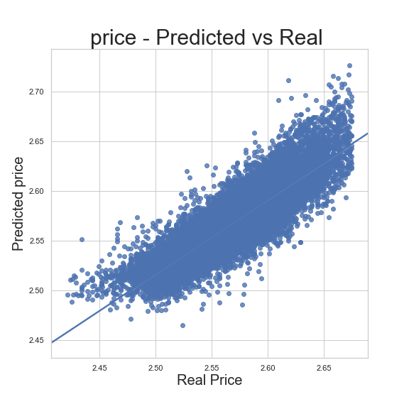

# Module 2 Final Project - Linear Regression

## Introduction

In this project I look at the provided housing proces dataset of the king county Washington state. 

## Objectives
The project onjectives are as follows. 
* What is the current price distribution ?
* What factors affects the value of a house ? 
* How does the price change over time ?
* Feature engineer, train, test and validate a multivariate linear regression model to predict housing prices. 

## File origanization

1. **student.ipynb**: Data loading and cleaning. Initial visualization and exploration of features. multicolliniarity and handling outliers. 
3. **modeling.ipynb**: Calculating initial regression model as a baseline. Choose a suitable library and algorithm. Explor features that needs to be changed, removed or add. Handle categorical data. Noemalize data. Feature engineering, regression diagnostics, test-train spliting and cross validation. 
4. **analysis.ipynb**: Analysis and drawing conclusion from the model. 

## comparison of real and predicted of house price 

=======

